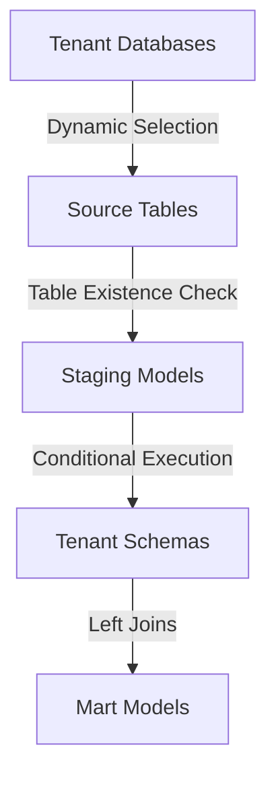

# Multi-Tenant dbt Project

Multi-tenant dbt pipeline with dynamic database selection and tenant-specific schema isolation. Automatically handles missing sources per tenant using conditional execution.


## Quick Start
```bash
# Run for a tenant
dbt run --vars '{"tenant": "TENANT1", "tenant_db": "tenant1_db"}'

# Run specific models
dbt run --select staging.* --vars '{"tenant": "TENANT1", "tenant_db": "tenant1_db"}'
```

## Project Structure
```
multi_Tenants/
├── macros/
│   ├── macros.yml           # Macro documentation
│   ├── table_exists.sql     # Table existence check
│   └── tenant_schema.sql    # Tenant schema generator
├── models/
│   ├── sources/sources.yml  # Source definitions
│   ├── staging/             # Platform staging models
│   └── marts/               # Combined business logic
├── tests/                   # Integration tests
│   ├── test_source_availability.sql
│   ├── test_conditional_execution.sql
│   └── test_tenant_isolation.sql
└── scripts/
    └── test_tenants.sh      # Automated test script
```


## Architecture


## Setup

### 1. Install Dependencies
```bash
pip install dbt-<adapter>  # e.g., dbt-snowflake, dbt-bigquery
```

### 2. Configure Profile
```yaml
# ~/.dbt/profiles.yml
multitenants:
  target: dev
  outputs:
    dev:
      type: snowflake  # or bigquery, redshift, etc.
      account: your_account
      user: your_user
      password: your_password
      database: your_database
      warehouse: your_warehouse
      schema: your_schema
```

## How It Works

**Conditional Execution:**
- Staging models only build if source tables exist
- `table_exists()` macro checks table existence
- Missing tables → staging model skipped
- Mart models use empty CTEs for missing sources
- Left joins return NULL for missing data

**Example:**
- Tenant A: Has Shopify + HubSpot + Facebook → all data in mart
- Tenant B: Has Shopify + HubSpot only → Facebook columns NULL
- Tenant C: Has Shopify only → HubSpot/Facebook columns NULL

## Variables

**Required:**
- `tenant`: Tenant name (e.g., "TENANT1")
- `tenant_db`: Tenant database name (e.g., "tenant1_db")

**Optional:**
- `TENANT_DB`: Environment variable (fallback)

## Data Sources

- **Shopify**: `orders`, `customers`
- **HubSpot**: `contacts`, `deals`
- **Facebook**: `ads`, `campaigns`

All sources use dynamic database via `tenant_db` variable.

## Common Commands

```bash
# Run all models
dbt run --vars '{"tenant": "TENANT1", "tenant_db": "tenant1_db"}'

# Run by platform
dbt run --select tag:shopify --vars '{"tenant": "TENANT1", "tenant_db": "tenant1_db"}'

# Check which sources tenant has (informational)
dbt test --select test_source_availability --vars '{"tenant": "TENANT1", "tenant_db": "tenant1_db"}'

# Run all tests
dbt test --vars '{"tenant": "TENANT1", "tenant_db": "tenant1_db"}'

# Generate docs
dbt docs generate --vars '{"tenant": "TENANT1", "tenant_db": "tenant1_db"}'
dbt docs serve
```

## Troubleshooting

**Models not running?**
- Verify `tenant` and `tenant_db` variables are set
- Run `dbt debug`

**Staging model skipped?**
- Table doesn't exist in tenant database (expected behavior)
- Not all tenants have all sources

**Missing data in marts?**
- Missing sources return NULL (expected)
- Verify source tables exist in tenant database
- Run `test_source_availability` to see which sources tenant has

## Resources

- [dbt Documentation](https://docs.getdbt.com/)
- [dbt Variables](https://docs.getdbt.com/docs/build/jinja-macros#variables)

## License

MIT License - see LICENSE file for details
